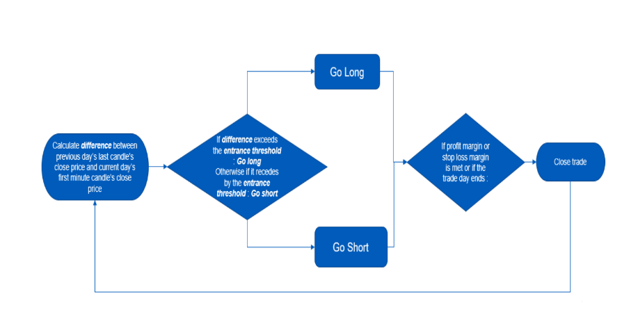
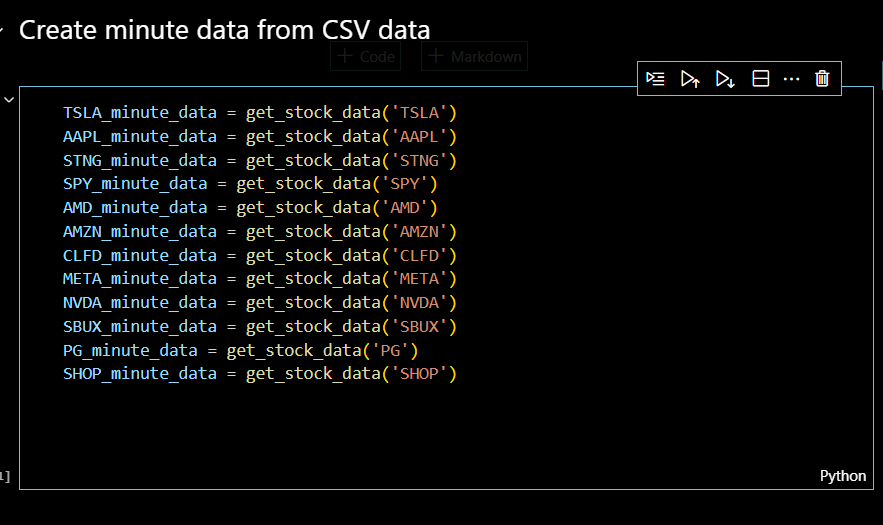

# 1PercentStrategy
Project for CSE 578 - Computational Investment

## Motivation

Our plan was to come up with something simple but something that is effective at the same time. Simple in the sense that is easily understood and implemented by a not so sophisticated retail investor/trader. Effective in the sense that wouldn't put the trader in the red and makes some money along the way.

As Warren Buffett once famously said: *"My life has been a product of compound interest."* We wanted to test it for ourselves in the intraday market. After discussing amongst ourselves i.e. the team and talking to a few finance students aka regular traders we know, we decided to pursue the *1PercentStrategy*.

Before defining the strategy, let me define the input parameters first. 

**Entrance Threshold:** The difference between two trading sessions to enter the trade, the
value which must be met to enter the trade.

**Stop loss Threshold:** The algorithm exits the trade when a loss of this margin has been
incurred. 

**Profit Threshold:** The user stays in the trade until this profit margin is met.

We were sure about the strategy is in terms of its **simplicity** but we had to prove its **effectiveness**. So we decided to backtest the strategy.

## Data

To backtest the strategy, we decided to go ahead with the granularity of 1 minute data. The primary reason being this is closest to realtime (albeit in the past) as it gets. Eventhough there were a few sources that had tick data but the data was very huge and there are no free resources to get the data from.

We used Alphavantage's Time Series Stock Data APIs [TIME_SERIES_INTRADAY(Adjusted)](https://www.alphavantage.co/documentation/#intraday-extended) in specific as this provided us with the last 2 years of data (with no money shelling out of our pocket).

## Flowchart

## How to use?
 First get the data of the stock you want to backtest the strategy against. 

 Then rest of the stuff is self-explanatory as in the [python notebook](https://github.com/ImVis10/1PercentStrategy/blob/master/1PercentStrategy.ipynb). Please make sure to go through it once.

 ## Future Scope
 We have a lot of things on our mind. But firstly we want to make things easier for the user. So we will host this as a service on some CSP and expose an API out of the service. There is no concrete plan yet but next we talked about,
 - Figuring out the underlying patterns
 - The reason behind those patterns
 - Tuning the input parameters to get the best possible results
 - Giving the user more freedom to define more parameters like allowing the principal to be distributed across different stocks and assign weightage based on his/her preference.
 - Backtest on data of longer time-frame (> 2 years)

 ## Contributors
 I'd like to sincerely thank my projectmates and friends [Abhilash](https://github.com/AbhilashBharadwaj), [Amudhesh](https://github.com/AMX0013) and Harsha for their time and effort towards this.